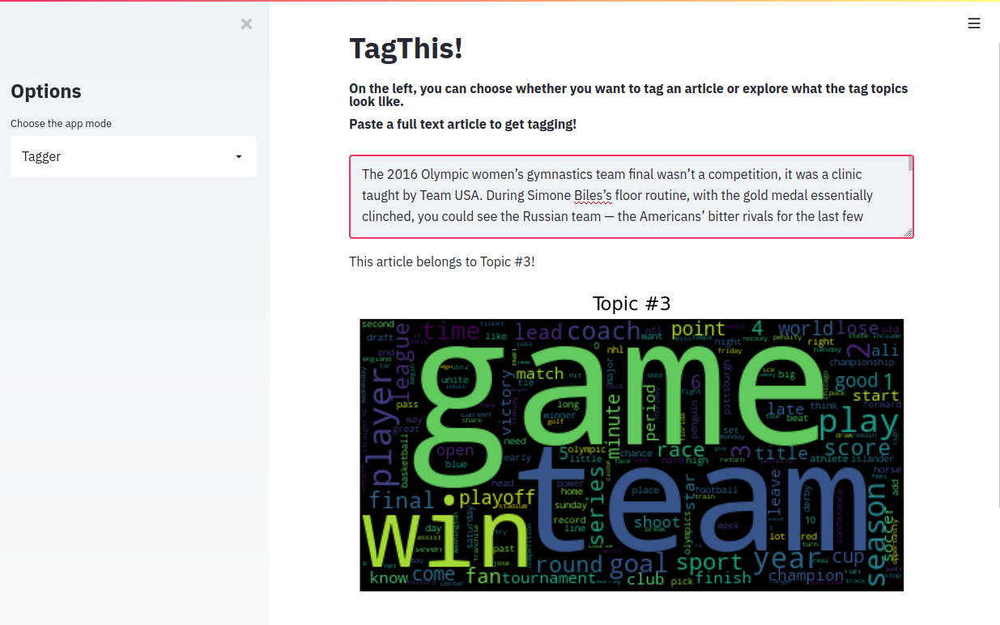
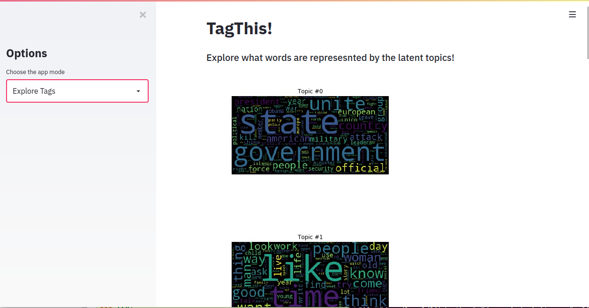
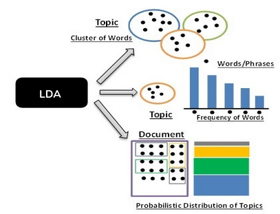
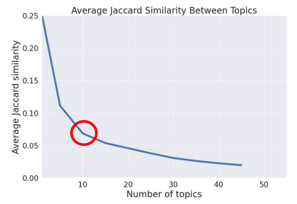

[](https://travis-ci.com/yeouchiou/TagThis)
# TagThis!

TagThis! is an automated news tagging system app that saves editors time by automatically creating topics and classifying articles so that editors can create relevant tags and quickly and easily curate news content. It leverages Latent Dirichlet Allocation (Blei+03) to create latent topics, then uses a support vector classifier to infer topics from new articles. 

## Setup

To simply run the app do the following:

1. git clone this repository and create an environment 
```
conda create -n tagthis python=3.6
conda activate tagthis
cd tagthis
```

2. Build Dockerfile
```
docker image build -t tagthis:app .
```

3. Run Dockerfile
```
docker container run -p 8501:8501 -d tagthis:app
```
## Advanced Setup

To run the app on new data, you need to install the package. You may also import your own classifiers.
1. git clone this repository and create an environment 
```
conda create -n tagthis python=3.6
conda activate tagthis
cd tagthis
```

2. Install package
`
python setup.py install
`

## How it works

The streamlit app has two modes. In the "tagger" mode you can paste a full text article and it will assign one of the latent topics from the LDA algorithm. You can then select relevant words as tags. In the "explore tags" option, you can explore all the different topics and tags. 




## Topic Modeling via Latent Dirichlet Allocation

Latent Dirichlet Allocation is a generative statistical model which creates latent topics from a corpus of docments. LDA assumes that each each document is a combination of different topics. So say document1 could be 50% topic1, 30% topic2, and 20% topic3. The topics themselves are abstract and can be represented by different words. For example, there might be a CAT_related topic which has probabilities to generate words such as milk, meow, or kitten. Given a preprocessed corpus of documents in bag of words representation, LDA outputs word probabilities for each topic as well as assigns the documents to mixtures of topics. 



We trained LDA on a Kaggle New York Times article dataset which contained around 9000 full-text articles from April to June in 2016. Articles had an average of about 800 words per article. We have used average Jaccard similarity between topics to choose the number of topics. From the elbow method, 10 topics were chosen for this dataset.


## Tag Classifier

Assuming that these topics are ground truth labels, we then trained a support vector machine (SVM) classifier with a Tf-Idf feature representation for the articles. SVMs allow for lightweight and fast inference due to only requiring the trained support vectors. The SVM achieves a micro-averaged precision of 88.6%!
